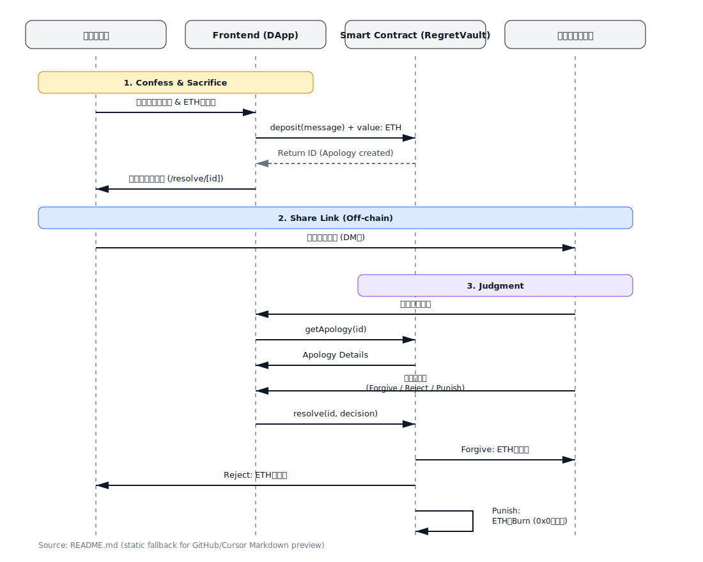
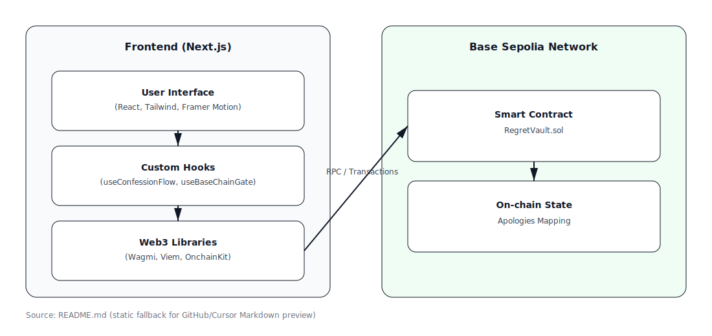

# Proof of Regret 🙇‍♂️💸

ブロックチェーンに「後悔」を刻み、その運命を相手に委ねるDApps。

## 概要

**Proof of Regret** は、謝罪の意志として ETH をロックし、その処理権限を相手に譲渡するDAppです。言葉だけの謝罪ではなく、金銭的な価値を犠牲にする覚悟を示すことで、真剣さを証明します。

### 仕組み

1.  **Confess (告白):** ユーザー（謝りたい人）は後悔のメッセージを書き込み、任意の額の ETH をデポジット（供託）します。
2.  **Sacrifice (犠牲):** スマートコントラクトに ETH がロックされ、解決用の共有リンクが発行されます。
3.  **Judgment (審判):** リンクを受け取った相手（謝罪を受ける人）は、以下の3つから運命を選択します。

| 選択 | 結果 | 意味 |
| :--- | :--- | :--- |
| **Forgive (赦す)** | ロックされた ETH は**謝罪を受ける人（相手）**が受け取ります。 | 賠償として受け取る。 |
| **Reject (拒絶)** | 謝罪を受け入れず、ETH は**謝りたい人（あなた）**に返金されます。 | 「金で解決しようとするな」という拒絶。 |
| **Punish (処罰)** | ETH は永久にアクセス不可能なアドレスへ送られ、**焼却（Burn）**されます。 | 誰も得をしない、純粋な罰。 |

審判を実行した相手には、結果を示すJudgment SBT が自動ミントされます。




## 技術スタック

-   **Frontend:** [Next.js 16 (App Router)](https://nextjs.org/)
-   **Blockchain Interaction:** [Wagmi](https://wagmi.sh/), [Viem](https://viem.sh/)
-   **State/Data:** [TanStack Query 5](https://tanstack.com/query/latest)
-   **UI/Animation:** [Tailwind CSS](https://tailwindcss.com/), [Framer Motion](https://www.framer.com/motion/)
-   **Smart Contract:** Solidity
-   **Network:** Base Mainnet (Chain ID 8453)




## すぐに始める

### 前提条件

-   Node.js v20 以上
-   npm または pnpm/yarn
-   Foundry (コントラクト開発を行う場合)

### 環境変数の設定

フロントエンドは RegretVaultV2 / RegretJudgmentSBT のアドレスを環境変数から参照します。`.env.local` などに以下を設定してください。

```bash
BASE_MAINNET_RPC_URL=https://mainnet.base.org
NEXT_PUBLIC_REGRET_VAULT_V2_ADDRESS=0x... # RegretVaultV2 のデプロイ先
NEXT_PUBLIC_JUDGMENT_SBT_ADDRESS=0x...    # RegretJudgmentSBT のデプロイ先
# optional
NEXT_PUBLIC_SITE_URL=http://localhost:3000
```

`BASE_MAINNET_RPC_URL` を省略するとパブリック RPC が使われますが、レートリミット回避のため設定を推奨します。

### デモ

-   本番: https://base-app-swart.vercel.app/

### インストール

```bash
git clone https://github.com/usagi917/base_hackathon2025.git
cd base_hackathon2025
npm install
```

### 開発サーバーの起動

```bash
npm run dev
```
ブラウザで `http://localhost:3000` を開いてください。

## スマートコントラクト

コントラクトのソースコードは `contracts/` ディレクトリにあります。

-   **RegretVaultV2 (メインで使用)**: Base Mainnet（Chain ID 8453）。デプロイ後、`.env` の `NEXT_PUBLIC_REGRET_VAULT_V2_ADDRESS` に設定してください。
-   **RegretJudgmentSBT**: 同時にデプロイし、`.env` の `NEXT_PUBLIC_JUDGMENT_SBT_ADDRESS` に設定してください。

### コントラクトのテスト・開発

```bash
cd contracts
forge install
forge test
```

## 注意事項

このプロジェクトは実験的なプロトタイプであり、現在は **Base Mainnet** での動作にも対応しています。
メインネットにデプロイする場合、実際の暗号資産を失う可能性があります（特に Punish が選択された場合、資金は永久に失われます）。

## ライセンス

MIT License
